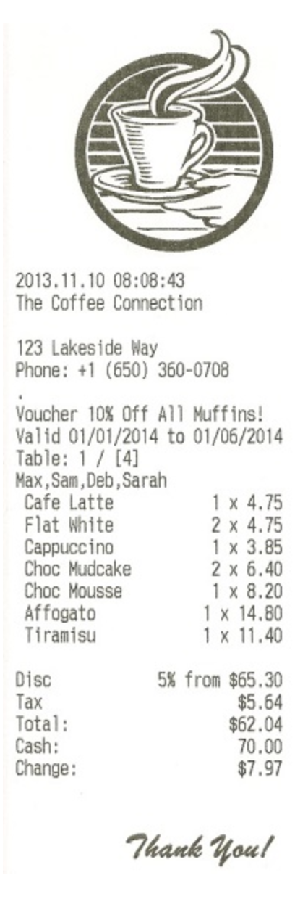

# Tech test #3 - Week 10

Till tech test
==============

We want to sell tills to a local hipster coffee shop who are finally embracing the 21st century. We need a new till to replace their vintage machines - unfortunately, hipster staff are too cool to learn a new system, so we need you to build something that they will understand.

### Specification
-------------

This is what a sample receipt looks like:

### Version 1
---------

Implement a system that contains the business logic to produce receipts similar to this, based on a `json` price list and test orders. A sample `.json` [file](hipstercoffee.json) has been provided with the list of products sold at this particular coffee shop. 

Here are some sample orders you can try - whether you use this information is up to you:

> **Jane**  
> 2 x Cafe Latte  
> 1 x Blueberry Muffin  
> 1 x Choc Mudcake  
>
> **John**  
> 4 x Americano  
> 2 x Tiramisu  
> 5 x Blueberry Muffin  

Your receipt must calculate and show the correct amount of tax (in this shop's case, 8.64%), as well as correct line totals and total amount. Do not worry about calculating discounts or change yet. Consider what output formats may be suitable.

#### Version 1 - Reflection
What I learned

* First time doing class extraction in Javascript. Will need to do further research and seek more coach feedback but seems similar to Ruby. 
* When extracting classes, determine which class the user will interact with most. Work from there. 
* Extract one feature at a time, every time. I got too comfortable and attempted to extract too much at once. Big mistake. It resulted in a lot of wasted time squashing bugs and eventually having to revert to a previous commit and try again. 
* Feature test frequently.

Notes for Ver 2
* Consider adding a TaxCalculator model to remove responsibility for Total model
* Refactor so the work is done through the order model rather than receipt model - it just makes more sense.
* To keep in mind for ver 3 - Currently logging the order to the console as return won't work to iterate through arrays in Javascript. Do more digging on how to get this to return/print somehow for user interface. 

### Version 2
---------

- Add functionality to take payment and calculate correct change.  
- Add functionality to handle discounts - in this example, a 5% discount on orders over $50, and a 10% muffin discount.

### Version 3
---------

Implement a user interface that can actually be used as a till.

You may use whatever technologies you see fit.
